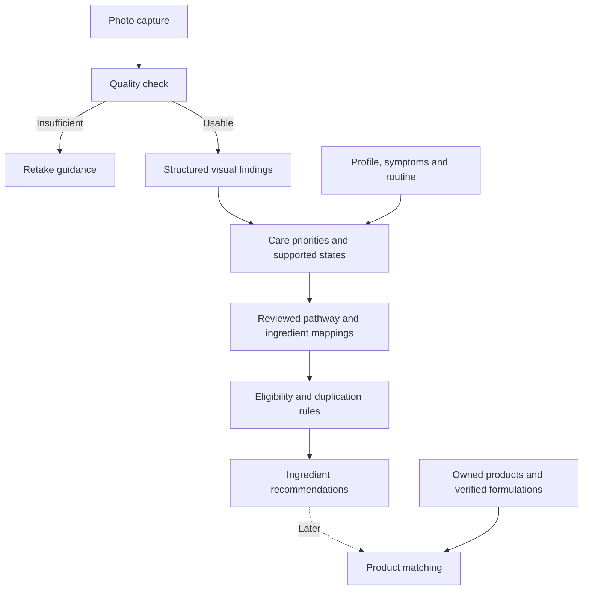

# Photo-to-ingredient architecture and decision log

Last updated: 2026-09-23

Status: full workbook graph coverage is implemented in the isolated OpenAI prototype, with versioned imports and explicit unresolved/proposed outcomes. Clinical validation, production integration and real product matching remain future work.

## How to use this document

This is the running record for the photo → findings → ingredients → products feature. Update it as the conversation progresses. Keep user requirements distinct from proposals, record changes in the decision log, and mark implementation complete only after verification. Future discussions can refer to this as the **Photo-to-Ingredient Architecture**.

## Confirmed user requirements

1. The user takes a photo.
2. The app scans it for skin concerns such as redness and acne.
3. The analysis leads to ingredient recommendations for better care.
4. Later, the app recommends products that use those ingredients.
5. Document the architecture and decisions as work progresses so they are easy to revisit.
6. Build on the existing isolated face-scan prototype, rather than beginning with the main Expo flow.
7. Remove YouCam analysis. The user has selected OpenAI because of YouCam cost, with questionnaire context intended to improve ingredient selection. Whether this provides sufficient accuracy remains to be evaluated.
8. Display linked ingredients beside the analyzed photo. Product recommendations remain a later stage.
9. Present the implementation plan before changing prototype behavior.

The user asked to leave the previously reviewed product databases alone for now because they need cleanup. No cleanup, import, or workbook modification is authorized by this architecture discussion.

## Proposed user experience

1. **Capture:** guide framing and lighting; request a retake when quality is insufficient.
2. **Findings:** show visible features, affected regions, and uncertainty. Separate visible redness or blemishes from a confirmed clinical condition.
3. **Care priorities:** interpret findings with relevant profile, symptoms, and current routine. Ask a short contextual question only when its answer can change eligibility or the recommendation.
4. **Ingredients:** show reviewed ingredient options, what finding each addresses, the care objective, the reason for selection, and any unresolved prerequisite. Options do not imply starting every ingredient together. No change is a valid result.
5. **Products, later:** reconcile suitable products already owned before suggesting additional purchases.

These details are proposals, not individually confirmed UX decisions.

## Proposed processing architecture

- AI produces structured visual observations. An explicit translation layer maps observations to supported care states; a visual score is not automatically a condition ID.
- A server-side selection service chooses canonical ingredient IDs from reviewed mappings and evidence. It does not invent new ingredient relationships per scan.
- Generated explanations are constrained to the selected ingredients and recorded decision reasons.
- Clinical rules can block or defer selection. Missing context remains unknown rather than becoming a negative answer or a pass.
- Preserve retake, insufficient-information, no-change, and clinician-review outcomes.
- Product matching later considers ingredient form, formulation, concentration when known, intended use, verification, and member context. INCI presence alone does not establish functional suitability.

## Proposed data boundaries

These are logical records, not finalized table names or migrations.

| Record | Required information |
| --- | --- |
| Scan | Photo reference, quality result, model/version, timestamp |
| Finding | Scan reference, visible feature, facial region, intensity, uncertainty |
| Ingredient recommendation | Ingredient ID, target finding/state, pathway, evidence references, eligibility, explanation, rules version |
| Product match, later | Recommendation reference, product/formula version, functional ingredient relationship, suitability, ownership, rationale |

Version results so recommendations remain explainable. Rule updates should allow a new recommendation run against existing findings without silently rewriting history or requiring a new photo analysis. Product matching should build on saved ingredient decisions.

User photos and personal records remain private and scoped to their owner. Shared reviewed knowledge is separate from personal outcomes. Personal learning must not automatically change global evidence.

## Workbook role

Reference: `/Users/dzuy/Desktop/SUBSTRATE_Condition_to_Ingredient_Engine_v3_HARDENED.xlsx`.

Reviewed on 2026-09-23. The workbook is an architecture specification and starter dataset, not an executable engine. It has 24 sheets, 16 condition/goal entries, 11 pathways, 14 ingredient entries, four evidence objects, two example products, three clinical rules awaiting approval, nine specified acceptance tests, and no spreadsheet formulas. These counts describe this file version, not clinical validation.

| Responsibility | Workbook sheets |
| --- | --- |
| Concern and pathway vocabulary | `01_CONDITIONS`, `02_PATHWAYS` |
| Ingredient vocabulary and candidate mapping | `03_INGREDIENTS`, `04_CONDITION_PATHWAY`, `05_PATHWAY_INGREDIENT` |
| Context and eligibility | `06_SIGNAL_MODIFIERS`, `07_GOVERNORS`, `08_MEMBER_STATE`, `19_CLINICAL_RULE_REGISTRY` |
| Evidence provenance | `11_SOURCES`, `12_EVIDENCE_OBJECTS`, `21_EVIDENCE_ADMISSION` |
| Product/formulation interpretation | `13_PRODUCT_INGR_EXPRESSION`, `14_PRODUCT_REALITY`, `22_EXPRESSION_ID_SPEC` |
| Existing routine and minimum change | `15_WARDROBE_COVERAGE`, `16_COVERAGE_VS_LOAD`, `17_MIN_EFFECTIVE_CHANGE` |
| Personal learning and boundaries | `10_OUTCOME_LEARNING`, `18_PERSONAL_EVIDENCE`, `20_EVIDENCE_FIREWALL` |
| Acceptance scenarios | `23_RULE_TESTS` |

Proposed use: curate approved workbook content into versioned database rules. Do not read the spreadsheet live at scan time or treat all starter rows as production-approved. Workbook instructions describe the intended system; they are not authorization to import, deploy, or modify data.

## Existing app integration points

Inspected on 2026-09-23:

- `src/services/photos.ts`: photo upload, metadata, signed URLs, and analysis invocation.
- `supabase/functions/analyze-photo/index.ts`: photo quality and visible cosmetic signals. Current fields include redness, dryness, congestion, fatigue, tone unevenness, and overall confidence; region-level findings are a proposed extension.
- `src/services/recommendations.ts`: current analysis, Skin Story, and Daily Plan orchestration.
- `src/skin-intelligence/`: existing skin-story and daily-plan rules.
- `src/services/catalog.ts`: existing ingredient, product, product–ingredient, and wardrobe relationships.

Proposed addition: a server-side ingredient-selection service between analysis and recommendation presentation. Exact API, schema, and relationship to existing rule engines remain to be designed. Existing ingredient advice does not establish that the workbook architecture has been implemented.

## Delivery scope and open decisions

Proposed first release: photo quality → visible findings → reviewed ingredient suggestions. Product matching follows catalog cleanup.

Still open:

- Which visible findings and care states are supported at launch?
- What quality and uncertainty criteria permit recommendations, and how will they be validated?
- Which profile/context questions are required before particular suggestions?
- Which mappings and evidence have been reviewed and approved for production?
- Where do scan results and ingredient cards live in the existing navigation?
- How many ingredient options should be shown, and how are alternatives grouped?
- What are the API contracts, persistence schema, retry behavior, and versioning rules?
- How are ingredient identities reconciled with the existing catalog?
- Who approves clinical rules and evidence changes?

## Decision log

| Date | Status | Record |
| --- | --- | --- |
| 2026-09-23 | User instruction | Hold work on the five previously reviewed product databases; cleanup is needed first. |
| 2026-09-23 | Reviewed | Hardened v3 workbook is a specification and starter dataset; no file changes made. |
| 2026-09-23 | User requirement | Photo → scan for concerns → ingredient recommendations → later product recommendations. |
| 2026-09-23 | Proposed | Separate AI observations from reviewed ingredient selection and generated explanations. |
| 2026-09-23 | Proposed | Use versioned decision records; match owned products and functional formulation suitability in the later product stage. |
| 2026-09-23 | User requirement | Maintain ongoing documentation for tracking and later questions. |
| 2026-09-23 | Completed | Created this architecture record and linked it from the main architecture document. No app behavior or source workbooks changed. |
| 2026-09-23 | User decision | Extend the existing face-scan prototype; remove YouCam and use OpenAI analysis plus questionnaire input. |
| 2026-09-23 | User requirement | Show condition/concern-linked ingredients next to the analyzed photo; plan the work first. |
| 2026-09-23 | Proposed plan | Implement the prototype plan below; no runtime changes made during planning. |

## Face-scan prototype implementation plan

### Starting point (before implementation)

The prototype already supports camera/upload, image preparation, server-side OpenAI calls, selectable models, eight visual concerns, detailed findings, and approximate region polygons. It also contains YouCam endpoints, task polling, overlays, cleanup, cost comparisons, and saved-experiment fields. No working questionnaire is currently supplied to analysis; the prompt explicitly says questionnaire context is absent.

### 1. Remove YouCam from the active prototype

- Remove provider implementation, start/status/asset/delete API actions, configuration flags, and provider-specific signing code.
- Remove the provider toggle, cards, comparison columns, overlays, polling/resume/cleanup UI, and cost comparison.
- Preserve OpenAI model selection, image preparation, regional display, access protection, server-only keys, and usage reporting.
- Revisit image-size constraints inherited from YouCam HD; use practical OpenAI prototype limits instead of silently retaining provider-specific requirements.
- Update README, tests, and main architecture references. Remove documented YouCam configuration requirements without deleting external credentials or making external API calls.
- Keep historical browser-saved experiments readable without starting YouCam requests. Do not erase historical data; make any legacy pending-task information explicit rather than claiming remote cleanup occurred.

### 2. Add a concise questionnaire

Proposed fields: primary goal, symptom duration, stinging/burning/itching, known sensitivity/allergies, current treatments/actives, recent procedures, age band, and reproductive context where eligibility depends on it. Support unknown/not provided; do not infer missing answers from a face.

Reuse entered answers for the current session. Keep follow-up questions conditional and explain why required answers matter. Do not introduce persistent sensitive-answer storage by default.

### 3. Separate visual evidence from contextual interpretation

- Retain the existing eight concerns: redness, acne-like blemishes, texture, pores, pigmentation, flaking, fine lines, and residual marks.
- Preserve structured visual findings independently of questionnaire answers so reported symptoms cannot become invented visible findings.
- Feed the visual result and validated questionnaire together into the care-state/ingredient resolver, with source attribution and uncertainty.
- Use explicit eligibility outcomes: candidate, needs more information, withheld, no change, or clinician review. No-face/failed-quality results cannot generate photo-derived recommendations.

### 4. Add a small versioned ingredient knowledge layer

- Use the hardened workbook as reference for canonical IDs, condition/pathway relationships, evidence references, and governors. Do not import the paused product workbooks.
- Create a prototype-scoped server-side mapping module/data file with traceable source rows and evidence status.
- Start with supported concerns and a deliberately limited reviewed ingredient set. Audit evidence applicability before enabling each mapping; workbook links and high scores alone are not approval.
- Resolve through findings/context → supported care state → pathway → ingredient candidates → eligibility. Deduplicate ingredients and preserve all supporting concerns.
- Record finding, ingredient, pathway, evidence, rule, and knowledge-version references. Use deterministic rules for candidate admission; generated wording cannot introduce new ingredient IDs or bypass a gate.
- Where evidence or clinical handling is unresolved, show an explanation or information request instead of an actionable recommendation.

### 5. Display ingredients alongside the photo

- Desktop: analyzed photo and current regional overlays on the left; prioritized ingredient cards on the right.
- Mobile: photo followed by ingredient cards.
- Each card shows ingredient, linked concern(s), care objective, concise reason, and eligibility/context note. Ingredient options are not a multi-active regimen.
- Selecting a concern or region highlights related ingredient cards; broader mappings remain explicitly concern-level when regional support is absent.
- Keep detailed findings expandable below. Provide useful empty, retake, loading, failure, and no-change states.

### 6. Recompute efficiently and preserve provenance

- Separate scan analysis from ingredient resolution. Questionnaire edits recompute candidates from the existing analysis without another paid image scan.
- Bind resolver input to the current server-issued analysis result (or an authenticated/tamper-evident result reference), rather than trusting arbitrary client-authored findings.
- New photos invalidate prior findings and ingredient results. Questionnaire changes invalidate prior contextual decisions until recomputation completes. Prevent late responses from replacing results for a newer photo or answer revision.
- Record model/prompt version, knowledge/rule version, analysis reference, answer revision, and result timestamp.
- Keep the prototype isolated from production Supabase and main-app behavior. Preserve existing privacy and access controls.

### 7. Validate the complete flow

- Mock provider tests for successful/malformed responses, no face, poor quality, unknown answers, and API failures.
- Resolver tests for provenance, allowed ingredient IDs, evidence gates, duplicates, conflicting context, existing treatments, and unresolved clinical rules.
- State tests for changed photos/answers, stale responses, recomputation without repeat image calls, and legacy saved results.
- Browser checks for photo plus ingredient layout, region/concern linking, keyboard access, mobile layout, and all fallback states.
- Run prototype tests and web build; confirm the main app is unaffected. Use a live consented-photo smoke test to assess usability and latency separately from clinical accuracy; do not claim validation from mocked tests.

Completion target: capture/upload → OpenAI findings → questionnaire-informed, traceable ingredient cards beside the photo, with no active YouCam integration and no product recommendations yet.

## Implementation record — 2026-09-23

The user authorized the build and requested clickable multiple-choice questions chosen for prototype testing. Implemented in `prototypes/face-scan`; the main Expo app, source workbook, and paused product databases are unchanged.

### Delivered

- Removed active YouCam provider, endpoints, polling, overlays, and comparison UI. Preserved historical local data without making remote cleanup claims.
- Kept OpenAI's eight visual concerns and regional display. Added server validation and 24-hour signed analysis references.
- Added 12 questions: goal, skin feel, duration, breakout pattern, existing treatments, recent changes/procedures, sensitivity, allergies, age band, reproductive considerations, photo confounders, and whether the existing routine helps. All appear together for rapid testing rather than conditional branching. None/Unsure are exclusive in multi-select groups.
- Added a server-side deterministic resolver. Answers do not enter the vision prompt; they contextualize ingredient selection after the visual analysis. Edits recompute without another paid scan; stale responses cannot replace a newer photo or answer revision.
- Added nine traceable workbook nodes with evidence and eligibility status. Moisturizing candidates: glycerin, ceramides, hyaluronic acid. Acne candidates: azelaic acid, salicylic acid, benzoyl peroxide. Niacinamide, vitamin C, and retinoids remain evidence-review concepts. These are a curated subset, not full workbook coverage.
- Added source-linked ingredient cards beside the photo, concern selection/highlighting, mobile stacking, retake/context/withheld/no-change states, and model/knowledge/source metadata.

### Deliberate limits and next decisions

The workbook and primary evidence sources inform provisional rules; no clinical validation is claimed. The photo quality threshold of 40 is an unvalidated prototype choice. Regional outlines are approximate, and card linking is concern-level rather than region-specific. Exact concentrations, formulation suitability, owned-product coverage, and combined regimens are not resolved. Product matching remains deferred.

The initial questionnaire is a testing hypothesis, not a validated instrument. Evaluate completion burden and which answers actually change useful outcomes before porting it into the main daily questionnaire. Consider conditional questions after this first test cycle.

Before production: evaluate real-photo accuracy and repeatability across lighting and skin tones; clinically review eligibility rules and remaining evidence mappings; decide retention/authentication requirements; then design the main-app integration and product matching. No deployment was performed.

### Verification

All 16 prototype tests pass, TypeScript checking and web build pass, and lint has no errors (one existing warning in `src/services/environment.ts`). Browser testing with a mocked provider verified photo upload, completed questionnaire, ingredient display, changing dry/tight context to enable moisturizing options, irritation withholding treatment actives, and concern-linked display without browser errors. No live OpenAI photo call was made during this verification; mocked results do not establish clinical accuracy.

### Testing convenience — preselected answers and Shuffle

The quiz now starts with a complete synthetic adult test profile, also restored for new experiments. Shuffle selects a random valid option for every question (one selection for multi-select groups). All options, including unknown and review-triggering context, can appear, so some combinations intentionally withhold ingredients. Manual editing remains available. Shuffling reuses the current signed analysis and updates ingredient eligibility without another OpenAI scan. Saved experiments retain their own answers.

### Quiz simplification — assumed age

At the user's request, removed the Tender / painful skin-feel option and the age question. The 11-question prototype assumes age 40–50, recorded as prototype context rather than a user answer. Shuffle cannot change this assumption. Legacy age answers are discarded, and legacy Tender / painful answers become Unsure when opened. The separate deep painful bumps/scarring choice remains unchanged. Knowledge version advanced to v2.

### Quiz disclosure and analysis activity

Added Collapse quiz / Expand quiz controls; progress and Shuffle remain visible when collapsed and selected answers are preserved. A sticky status banner with a spinner stays visible throughout analysis and ingredient resolution, then disappears on success or failure. The Analyze button also displays Analyzing while busy. Reduced-motion preferences disable spinner rotation.

### Ingredient panel presentation

Renamed the panel Ingredients, removed its Context Matters badge and the introductory/general context blocks shown in the user's screenshot. Ingredient chips now appear first and jump to each ingredient's details. Individual eligibility reasons and empty-result explanations remain available.

Quiz disclosure now uses ↑ when expanded and ↓ when collapsed, retaining accessible Collapse quiz / Expand quiz labels and tooltips.

## Full prototype expansion plan

The user requested a complete condition-to-ingredient plan while preserving the isolated prototype and future product portability. See [Full ingredient prototype plan](FULL_INGREDIENT_PROTOTYPE_PLAN.md). Reinspection found 16 condition-pathway edges across only eight of the 16 conditions, 21 pathway-ingredient edges, missing downstream edges for pigment/vascular/adipose pathways, provisional evidence admission and three unresolved clinical rules. The plan covers every source entry and explicitly distinguishes missing mappings, proposed extensions, fixture-only integrations and unresolved outcomes. No runtime expansion was implemented during this planning turn.

### Full workbook prototype implementation

The user approved the full plan with a requirement to ingest future workbook revisions. Implemented `import-workbook.py` (stage/report/activate), source snapshots, the portable `packages/ingredient-engine` TypeScript evaluator, full graph coverage, conditional questions and 16 named synthetic scenarios, grouped ingredient chips, decision traces, and explicit local session saving/re-evaluation history. The importer reports changed records and blocks incompatible schemas/references; rule changes need implementation review before activation.

The complete graph preserves 16 conditions, 11 pathways and 14 ingredients. Missing source links are labeled proposed, not silently treated as source or approved evidence. All 14 nodes are reachable; research-only or unresolved entries retain that outcome. Data-driven evidence matching respects ingredient identity and endpoint scope. The old hardcoded nine-node subset is retired.

Product expression, no-buy and learning/firewall behavior is exercised in nine workbook acceptance cases with synthetic fixtures. Actual product matching, external signals and long-term personal learning remain unconnected. This is full source-entry accounting and an executable condition-to-ingredient prototype, not a claim of complete clinical evidence or production product orchestration.

Verification of this expansion: 48 prototype/engine tests and four importer compatibility tests passed, plus TypeScript and web build. Browser QA used labeled synthetic acne/dehydration scenarios and confirmed save/reopen and responsive chips. Live-photo accuracy and clinical evidence approval were not claimed from those tests.

## 2026-09-23 — Curated product suggestions

Implemented Product Suggestions above Concern signals in the face-scan prototype. A small versioned US catalog supplies brand-linked product cards; catalog scope is a quiet footer, not a prominent testing banner. Products are alternatives, not a combined routine. No pricing, stock, checkout, or larger database connection is included.

The server evaluates ingredients first, then passes the same decision to the portable `packages/ingredient-engine/src/products.ts` matcher. Only candidate ingredients qualify; retake, referral, pending evidence, held treatment and no-change results never become product recommendations. Treatment products require their treatment ingredient to qualify, so incidental glycerin cannot bypass a hold. Multiple matched ingredients deduplicate to one product. Stable ordering covers distinct ingredients before alternatives; concentration is not a ranking score. Up to four cards appear. Quiz edits clear both ingredient and product results until the same guarded request completes. Saved decisions retain the catalog and workbook/rule versions; older results require re-evaluation.

`prototypes/face-scan/catalog/curated-products.json` is an independent catalog adapter, currently containing The Ordinary Salicylic Acid 2% Solution, The Ordinary Azelaic Acid Suspension 10%, PanOxyl Acne Creamy Wash 4%, Paula’s Choice SKIN PERFECTING 2% BHA Liquid Exfoliant, and CeraVe Moisturizing Cream. Official brand URLs and the review date are stored per catalog/product. Concentrations remain null when unpublished. CeraVe stays unmatched while the corresponding support ingredients remain evidence-review-only in the workbook; adding a product never admits missing evidence. Brand ingredient facts do not prove finished-formula efficacy or prescription equivalence.

Later work: replace catalog ingestion independently of ingredient decisions; validate full formulas, regional variants, ownership/wardrobe coverage, price/availability and retrieval performance before broader product integration. The paused source databases remain untouched.

### Detailed analysis ingredient pills
Each Detailed OpenAI analysis card now shows its related ingredient pills beneath the concern heading, using the existing decision’s concern links. Held or pending ingredients retain a visible status label. Pills clear and refresh alongside ingredient results when questionnaire answers change; no additional analysis call or new mapping is introduced.

Detailed-analysis ingredient pills use red styling unless their status is withheld (displayed as “On hold”), which uses gray. Other status labels remain visible; color does not change eligibility.

Concern signals is collapsible, initially expanded, with the same up/down arrow and shared accessible toggle behavior as the questionnaire. Collapsing hides the scores and explanatory copy while retaining the heading.

### Notebook removed from prototype
Removed experiment notes, Save/Export controls and Saved experiments, including their UI and browser-storage handlers. Current analysis remains in memory for this page session. Previously stored browser records are not deleted.

## Broader workflow demo — 2026-09-23

Catalog v2 contains 12 official-brand-linked US products, adding moisturizers, barrier care, hydration, niacinamide, mineral SPF and a gated retinol entry. Product facts were checked against the linked manufacturer pages. The workbook and its evidence admissions remain unchanged.

A separate `demoItems` response now lets pending/context-dependent support ingredient links reach catalog examples. These cards are explicitly marked “Demo example” and do not claim personalized suitability. They retain the original ingredient status; they never enter the eligible `items` array. Up to four examples cover distinct product categories before duplicates. Sunscreen is demo-only: its labeled SPF is not inferred from supporting ingredients. Retinol and acne treatments require eligibility and cannot enter the demo fallback. Held, clinician-review, research-only or already-covered ingredient expressions exclude the entire product from demo results. Retakes, known/unknown allergies, current stinging/itching, procedure/wound contexts and an already-working routine suppress examples. This does not guarantee products for every scan.

The UI clears both collections when answers change. Catalog and demo policy versions accompany results. Larger database integration remains deferred. Tests cover catalog IDs, category diversity, evidence separation and hold propagation. This supersedes the earlier five-product-only description.

### Simplified ingredient panel
The main Ingredients panel now displays pills only. Removed per-ingredient detail cards, explanation/source blocks, notes and the decision inspector from this panel. Pills no longer imply a click opens details. Decision evidence, status and product eligibility rules remain in the underlying result.

Product Suggestions now appears at the bottom of the prototype, after Detailed OpenAI analysis and before the footer.

Renamed the detailed results section to “Detailed Analysis” and added 32px of spacing before Product Suggestions.

### Consistent panel headings
All top-level panels now use the same 20px semibold heading and header spacing: Source Photo, Questionnaire, Photo Analysis, Ingredients, Concern Signals, Scan Summary & Usage, Detailed Analysis and Product Suggestions. Removed the numbered eyebrow hierarchy; scan status lives in the Photo Analysis header. Nested concern/product titles share a 17px semibold style. Disclosure panels use the same up/down arrow convention.

## 2026-09-24 — Local password-free access
The loopback prototype no longer requires a password, even if FACE_SCAN_PROTOTYPE_PASSWORD is configured. Hosted authentication, origin checks and signed analysis validation remain unchanged.

## 2026-09-24 — Hosted password removal authorized
The user explicitly approved password-free production access and its paid API exposure. Removed the hosted password gate, browser password form and password request header. Legacy password environment settings are ignored. Origin checks and signed analysis validation remain. This supersedes the local-only change above.
